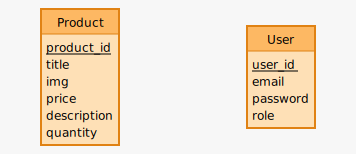

# Cachier des charges Supermarket

## La présention du projet :
Le projet consiste à développer une application de superette pour permettre aux clients de voir la liste des produits vendus. Le projet doit comporter un front-end pour afficher la liste des produits et une interface d'administration pour ajouter, modifier ou supprimer des produits. L'interface d'administration sera développée avec easyadmin et sera sécurisée par un email et un mot de passe.

# Les fonctionnalités
## Pour les clients :
- Afficher la liste des produits disponibles dans la superette
- Consulter les détails d'un produit (image, prix, titre, description et quantité)
## Pour les employés :
- Se connecter à l'interface d'administration sécurisée
- Ajouter un nouveau produit à la liste
- Modifier les informations d'un produit existant
- Supprimer un produit de la liste

# Technololgies utilisées pour le projet 
## Versions
- PHP v8.2.2  
- Symfony v6.3
## 
- Front-end: Symfony, Tailwindcss
- Back-end: Symfony, Easyadmin
- Base de données : Mariadb (v10.11.2)

# L'arborescence de l'application coté visiteur
```
├── /home 
│    └── /products
│           └── /products/{product_id} 
├── /admin 
│
```

# La liste des routes
## Front-end
| URL | Méthode HTTP | Titre | Contenu | Commentaire |
|--|--|--|--|--|
| / | GET | Accueil | Page d'accueil | Page d'accueil pour les utilisateurs du site |  
| /products | GET | Produits | Liste des produits | Page de présentation de tout les produits disponible |
| /products/{id} | GET| Produit par ID | Page produit  | Page de présentation de toutes les informations d'un produit spécifique |
| /admin | GET | Connexion administrateur | Formulaire de connexion administrateur | Page de connexion pour accéder à EasyAdmin |
| /admin | POST | Connexion administrateur | Traitement du formulaire de connexion | Action pour traiter les données du formulaire de connexion et connecter l'utilisateur administrateur |`

## Back-end
| URL | Méthode HTTP | Titre | Contenu | Commentaire |
|--|--|--|--|--|
| /admin | GET | Admin Dashboard | Tableau de bord administrateur | Page d'accueil du backend EasyAdmin |  
| /admin/product | GET | Products | Liste des produits | Page de présentation de tout les produits disponible |
| /admin/product/new | GET | Create Product | Formulaire de création de produit  | Page pour créer un nouveau produit |
| /admin/product/new | POST | Create Product | Enregistrer un nouveau produit  | Action pour enregistrer les données d'un nouveau produit |
| /admin/product/{id}/edit | GET | Edit Product | Formulaire de modification de produit  | Page pour modifier les informations d'un produit existant |
| /admin/product/{id}/edit | PUT | Edit Product | Enregistrer les modifications d'un produit  | Action pour enregistrer les modifications d'un produit existant |
| /admin/product/{id} | GET | Show Product | Page produit | Page de présentation de toutes les informations d'un produit spécifique |
| /admin/product/{id}/delete | DELETE | Delete Product | Supprimer un produit | Action pour supprimer un produit existant |`

# Les documents relatifs à la BDD
## MCD


# La liste des User stories 
## Front-end
- En tant qu'utilisateur, je veux pouvoir naviguer facilement sur le site pour trouver les produits qui m'intéressent.

- En tant qu'utilisateur, je veux pouvoir afficher les détails des produits pour en savoir plus sur eux.

## Back-end
- En tant qu'administrateur, je veux pouvoir ajouter, modifier ou supprimer des produits pour les mettre à jour sur le site.